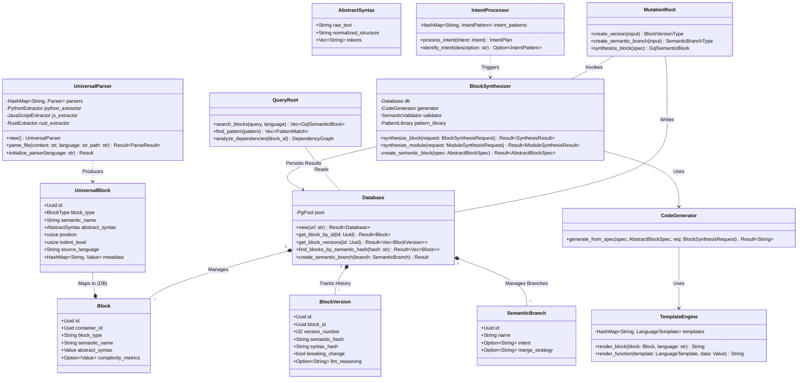

# Architecture Assessment: MetaForge Engine

## Executive Summary
The `metaforge-engine` is a **substantial, well-architected Rust application** designed for semantic code analysis and evolution. It is **not** a hollow shell; it possesses a robust core based on `tree-sitter` parsing and a sophisticated PostgreSQL data model.

However, many of its "AI" and "Synthesis" features are currently **heuristic-based or in early stages of implementation** (stubs/placeholders). The architecture is sound and scalable, but the implementation of advanced features is effectively in a "Phase 1" state.

## 1. System Overview (Detailed UML)

The following diagram illustrates the comprehensive class architecture of the `metaforge-engine`.



## 2. Core Architecture (Strong)

### 2.1 Parsing & Extraction (`src/parser`)
*   **Technology**: Uses `tree-sitter` for robust, error-tolerant parsing.
*   **Design**: Implements a `UniversalBlock` abstraction that normalizes code structures.
*   **Verdict**: **Solid**. Real implementation.

**Snippet: `src/parser/universal.rs`**
```rust
pub fn parse_file(&mut self, content: &str, language: &str, file_path: &str) -> Result<ParseResult> {
    let parser = self.parsers.get_mut(language)
        .ok_or_else(|| anyhow!("Unsupported language: {}", language))?;
    
    let tree = parser.parse(content, None)
        .ok_or_else(|| anyhow!("Failed to parse file"))?;
    
    // Single extraction path - no duplication
    let mut extraction_result = match language {
        "python" => self.python_extractor.extract_with_context(tree.root_node(), content, file_path)?,
        // ... handled other languages
    };
    // ...
```

### 2.2 Data Model (`src/database`)
*   **Schema**: Comprehensive SQL schema tracking hierarchy, history, and AI metadata.
*   **Verdict**: **Excellent**. Supports advanced versioning and LLM tracking.

**Snippet: `src/database/schema.rs`**
```rust
pub struct BlockVersion {
    pub id: Uuid,
    pub block_id: Uuid,
    pub version_number: i32,
    // ...
    // LLM tracking
    pub llm_provider: Option<String>,
    pub llm_model: Option<String>,
    pub llm_prompt_id: Option<Uuid>,
    pub llm_reasoning: Option<String>,
}
```

## 3. Deep Dive: The AST Strategy & AI Integration

The decision to use **Tree-sitter** combined with the **`UniversalBlock`** data model is the architectural linchpin that enables the "AI" features. This section analyzes why this choice was made and what it unlocks.

### 3.1 Why Tree-sitter? (The Concrete Syntax Tree)
Unlike traditional compiler ASTs (which are abstract and discard whitespace/comments) or pure text processing (which is fragile), Tree-sitter provides a **Concrete Syntax Tree (CST)**.

1.  **Error Tolerance**: This is critical for AI. LLMs often generate incomplete or slightly malformed code (e.g., missing a closing brace). Tree-sitter can parse these **partial states** without crashing, allowing the engine to "heal" the code or extract partial intent.
2.  **Polyglot Uniformity**: It provides a normalized C-API for parsing languages from Python to Rust. This allows `metaforge-engine` to treat 10+ languages with a single `UniversalParser` infrastructure.
3.  **Preservation**: Since it tracks byte offsets of every node, refactoring operations can be precise ("replace bytes 10-50") without re-formatting the entire file and annoying the user.

### 3.2 The Data Model: `UniversalBlock` as an AI Interface
The `UniversalBlock` struct acts as a **Tensor-ready representation of Code**.

*   **Normalization**: It squashes language idiosyncrasies. A Python `def` and a Rust `fn` both become a `BlockType::Function`.
    *   *AI Benefit*: The AI agent learns general patterns ("Functions have 3-10 lines") without overfitting to syntax keywords (`def` vs `fn`).
*   **Granularity**: By breaking files into *Blocks*, the system solves the **LLM Context Window** problem.
    *   *RAG Optimization*: Instead of stuffing a 2,000-line file into the prompt (expensive/slow), the system retrieves only the 3 specific `Block`s related to the user's intent.
    *   *Precision*: Embeddings are calculated per-block. Searching for "password hashing" retrieves the specific function `hash_pwd`, not the entire `auth.py` file.

### 3.3 Semantic Hashing & Deduplication
The data model enables **Semantic Hashing** (seen in `semantic_hash` field).
*   **Mechanism**: Hash the *structure* of the AST (nodes types + values), ignoring whitespace/comments.
*   **Possibility**: Detect that `function A()` in File 1 is semantically identical to `function B()` in File 2.
*   **AI Use Case**: "Code Deduplication Agent". The AI scans the database for blocks with identical semantic hashes but different names, and proposes merging them into a shared utility.

### 3.4 Validated Generation (The Loop)
The architecture enables a **Rejection Sampling** loop for AI generation:
1.  **AI Proposes**: LLM outputs a code snippet.
2.  **System Validates**: Engine parses the snippet with Tree-sitter.
    *   *Valid Syntax?* If no, reject immediately (don't even save to DB).
    *   *Valid semantics?* engine checks if the AST contains forbidden nodes (e.g., `eval()`).
3.  **System Accepts**: Only structurally valid code enters the `UniversalBlock` lifecycle.

## 4. Code Generation & Synthesis (Mixed)

### 3.1 Template Engine (`src/generator`)
*   **Implementation**: String-based replacement (Handlebars-style).
*   **Verdict**: **Functional but Primitive**. Good for scaffolding, fragile for refactoring.

**Snippet: `src/generator/templates.rs`**
```rust
// Rust templates
templates.insert("rust".to_string(), LanguageTemplate {
    function_template: "{{visibility}}{{modifiers}}fn {{name}}{{generics}}({{params}}){{return_type}}{{where_clause}} {\n{{body}}\n}".to_string(),
    // ...
});
```

### 3.2 Synthesis & AI (`src/ai_operations`)
*   **Intent Processing**: Rule-based expert system using keyword matching.
*   **Verdict**: **Early Stage**. Structure exists, but logic is deterministic.

**Snippet: `src/ai_operations/intent_processor.rs`**
```rust
// Performance optimization patterns
self.intent_patterns.insert(
    "performance".to_string(),
    IntentPattern {
        keywords: vec![
            "optimize".to_string(), "performance".to_string(), "faster".to_string(),
            "cache".to_string(), "speed".to_string(), "efficient".to_string(),
        ],
        operation_template: OperationType::OptimizePerformance {
            techniques: vec![OptimizationTechnique::Caching],
        },
        complexity_multiplier: 2.0,
    },
);
```

## 4. Real Capabilities vs. Hype

| Feature | Claim/Appearance | Actual Implementation | Status |
| :--- | :--- | :--- | :--- |
| **Parsing** | "Universal Polyglot Parsing" | Real `tree-sitter` integration with generic mapping. | ✅ **Real** |
| **Storage** | "Semantic Knowledge Graph" | Relational DB with recursive hierarchy and pointers. | ✅ **Real** |
| **Intents** | "Natural Language coding" | Keyword/Regex matching mapping to logic templates. | ⚠️ **Rule-based** |
| **Generation**| "AI Code Synthesis" | String templates + heuristics. | ⚠️ **Template-based** |
| **Evolution** | "Self-evolving Code" | Defined data models for evolution, but logic is basic. | 🚧 **In Progress** |

## 5. API Analysis

### 5.1 Rust Engine API (GraphQL)
The core engine exposes a GraphQL API (`src/graphql`) designed for rich querying and semantic operations.

#### **Read Operations (Queries)**
*   **Status**: ✅ **Implemented**
*   **Key Resolvers**:
    *   `search_blocks(query, language)`: Semantic search using Postgres `tsvector`.
    *   `find_pattern(pattern)`: Targeted search for specific code patterns (e.g., "async functions", "untested code").
    *   `analyze_dependencies(block_id)`: Traverses `block_relationships` to build a dependency graph.
    *   `semantic_diff(v1, v2)`: Compares versions for behavioral/interface changes.

#### **Write Operations (Mutations)**
*   **Status**: ⚠️ **Mixed / Early Stage**
*   **Real Implementations**:
    *   `create_version`: semantic versioning logic is hooked up to `SemanticVersionControl`.
    *   `create_semantic_branch`: Implementation appears functional for branching strategy.
*   **Placeholders**:
    *   `synthesize_module`: Returns hardcoded "TODO" file content.
    *   `apply_refactoring`: Returns a "not yet implemented" warning.
    *   `generate_code`: Returns Python `pass` statements as placeholders.

### 5.2 Python Visualizer API (REST)
The visualizer (`ast-visualizer`) provides a read-only REST API via Flask (`src/api/project_api.py`) for frontend consumption.

*   **Design**: Standard REST endpoints returning JSON `view_data` and chart configurations.
*   **Routes**:
    *   `GET /api/v2/project/<id>/overview`: High-level metrics and entry points.
    *   `GET /api/v2/project/<id>/dependencies`: returns dependency graph data for visualization.
    *   `GET /api/v2/project/<id>/metrics`: Aggregates complexity and volume stats.

## 6. Intended Use Cases & Possibilities

Based on the architectural components and data models, the `metaforge-engine` is designed to solve the following high-level problems. Each use case is detailed with a specific **Scenario** (how it works today) and **Future Possibilities** (what the architecture enables).

### 6.1 Automated Large-Scale Refactoring
*   **Core Concept**: Apply consistent patterns across a massive polyglot codebase without regex fragility.
*   **The Scenario**: *API Deprecation*
    *   **User Action**: "Replace all calls to `old_db.query(sql)` with `new_repo.execute(sql, context)` and inject the context dependency."
    *   **System Action**:
        1.  **Parse**: `UniversalParser` builds the semantic graph of the entire project.
        2.  **Search**: `database` identifies all usages of `old_db.query`.
        3.  **Plan**: `IntentProcessor` creates a plan to modify function signatures (add `context`) and bodies.
        4.  **Execute**: `BlockSynthesizer` generates the new function bodies safely.
*   **Possibilities**:
    *   **Security Patching**: Automatically detect and fix SQL injection patterns semantically across 1M+ LOC.
    *   **Style Enforcement**: Enforce architectural rules (e.g., "Service layer must not call DB directly") by detecting violations and auto-generating the adapter layer.

### 6.2 Semantic Code Search & Exploration
*   **Core Concept**: Find code based on *meaning* and *behavior* rather than just grep/text match.
*   **The Scenario**: *Onboarding a New Developer*
    *   **User Action**: "How does this application handle user authentication?"
    *   **System Action**:
        1.  **Query**: Search vector embeddings (`tsvector`) for "authentication", "login", "identity".
        2.  **Graph Traversal**: `analyze_dependencies` maps the flow from the API controller $\to$ AuthService $\to$ UserRepository.
        3.  **Visualise**: The `ast-visualizer` renders this specific sub-graph, asking the user if they want to see the "Role Based Access" logic as well.
*   **Possibilities**:
    *   **Impact Analysis**: "If I change this `User` struct, which 50 API endpoints will have serialisation errors?"
    *   **Automated Documentation**: Generate "Living Documentation" that updates itself whenever the code logic changes.

### 6.3 Polyglot Code Migration
*   **Core Concept**: Translate logic from one language to another while preserving structure and intent.
*   **The Scenario**: *Legacy Modernization*
    *   **User Action**: "Convert this legacy Python Flask backend to a Rust Axum service."
    *   **System Action**:
        1.  **Extract**: Parse Python code into `UniversalBlock` format (language-agnostic).
        2.  **Map**: `BlockSynthesizer` maps Python classes to Rust structs and methods to `impl` blocks.
        3.  **Render**: `TemplateEngine` outputs valid Rust code using the "Axum" template pack.
*   **Possibilities**:
    *   **Dual-Stack Maintenance**: Maintain a "Core" in Rust and automatically generate idiomatically correct bindings for Python, Node.js, and Wasm consumers.
    *   **Framework Swapping**: Migrate from React to Vue (or vice versa) by lifting components to abstract UI blocks and re-rendering them.

### 6.4 AI-Assisted Development (The "Agentic" Workflow)
*   **Core Concept**: Allow AI agents to safely modify code by constraining them to structural operations.
*   **The Scenario**: *Feature Implementation*
    *   **User Action**: "Add a rate limiter to the generic API handler."
    *   **System Action**:
        1.  **LLM Interaction**: The LLM suggests the *logic* (token bucket algorithm).
        2.  **Constraint Check**: The `SemanticValidator` ensures the proposed code doesn't violate type safety or architectural layering.
        3.  **Synthesis**: The system inserts the correct middleware block and imports, guaranteeing no syntax errors or dangling references.
*   **Possibilities**:
    *   **Self-Healing Systems**: A CI pipeline failure triggers the engine to analyze the stack trace, locate the failing block, generate a fix, verify it locally, and push the patch automatically.
    *   **Test Generation**: "Write unit tests for every function that has high cyclomatic complexity and low coverage."

### 6.5 Semantic Version Control
*   **Core Concept**: Track code evolution at the function/block level, enabling "Google Docs for Code" capabilities.
*   **The Scenario**: *Semantic Merge*
    *   **User Action**: "Merge branch 'feature-A' into 'main'. Both modified the same file."
    *   **System Action**:
        1.  **Diff**: Compare `BlockVersion` hashes.
        2.  **Analyze**: Detect that Branch A renamed the function, and Branch B optimized the body.
        3.  **Resolve**: Automatically merge by applying the new body to the renamed function (impossible with text-based git merge).
*   **Possibilities**:
    *   **Function-Level Rollback**: "Undo the changes to *just this algorithm* from last week," without reverting the other 50 files changed in that commit.
    *   **Semantic Cherry-Picking**: Move a feature (a set of related blocks) to another project seamlessly, bringing its dependencies along.

## 7. Conclusion & Recommendations
The `metaforge-engine` is a legitimate engineering tool with a solid foundation. It is capable of:
1.  **Ingesting** large polyglot codebases.
2.  **Mapping** their structure to a database.
3.  **Generating** scaffold code via templates.

It is **not yet** a generic "AI Developer" that can autonomously fix bugs or refactor complex logic using LLMs, though the *structures* for it are in place.
